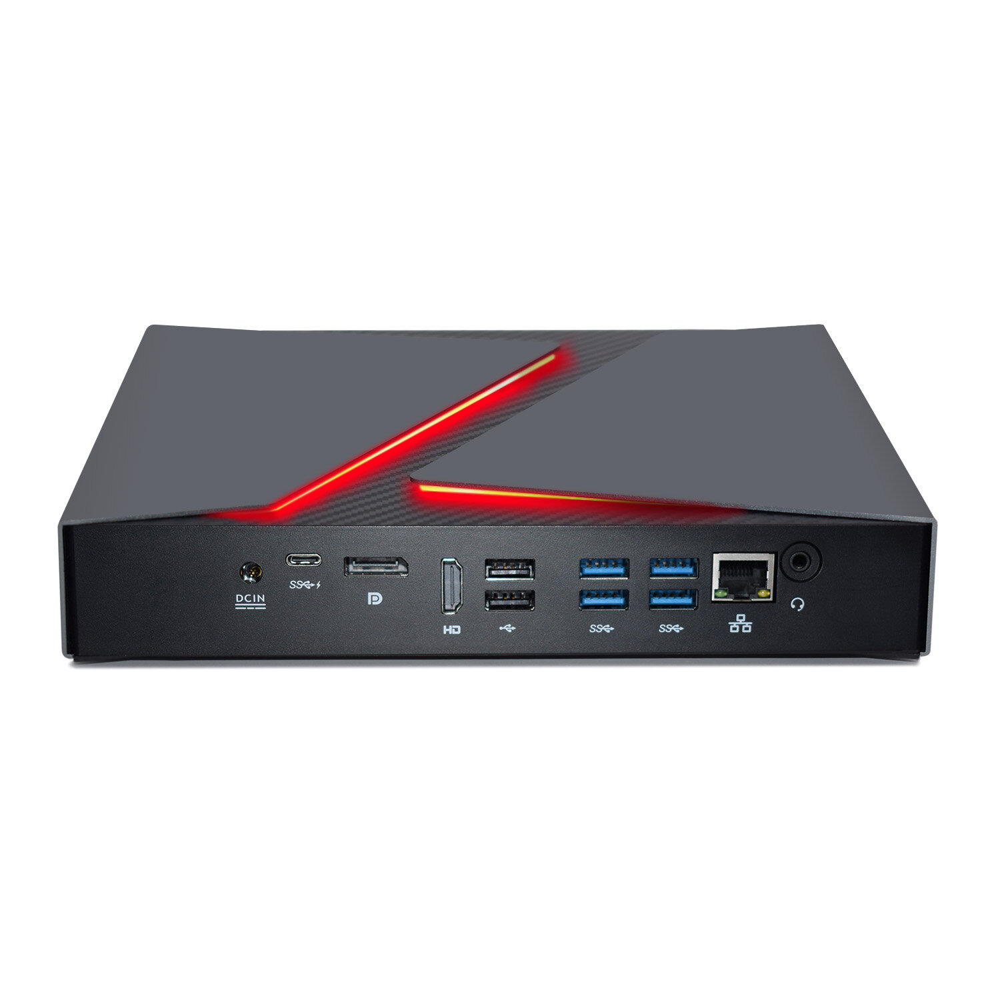
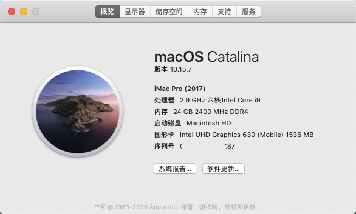
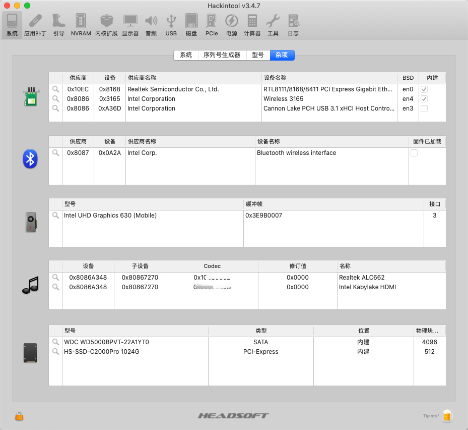
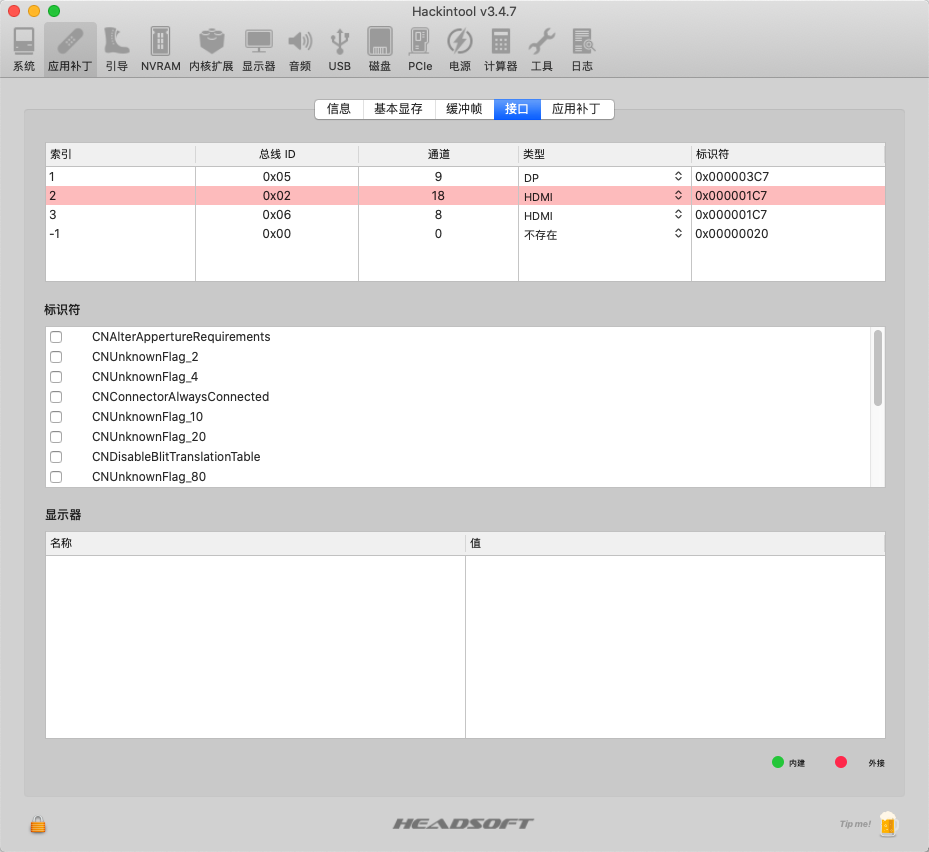

# Gaming-MiniPC-F7-Hackintosh

|  规格   | 详细信息  |
|  ----  | ----  |
| 电脑型号  | gaming mini pc f7 |
| 处理器  | 英特尔 酷睿 i9 - 8950HK |
| 内存  | 24G |
| 硬盘  | 海康威视C2000PRO - 1T |
| 显卡  | 核显 |
| 网卡  | intel 3165 |

---

# BIOS设置

### 禁用
Fast Boot
Secure Boot
Serial/COM Port
Parallel Port
VT-d (can be enabled if you set DisableIoMapper to YES)
CSM
Thunderbolt(For initial install, as Thunderbolt can cause issues if not setup correctly)
Intel SGX
Intel Platform Trust
CFG Lock (MSR 0xE2 write protection)(This must be off, if you can't find the option then enable AppleXcpmCfgLock under Kernel -> Quirks. Your hack will not boot with CFG-Lock enabled)

### 启用
VT-x
Above 4G decoding
Hyper-Threading
Execute Disable Bit
EHCI/XHCI Hand-off
OS type: Windows 8.1/10 UEFI Mode
DVMT Pre-Allocated(iGPU Memory): 64MB
SATA Mode: AHCI

# 截图

